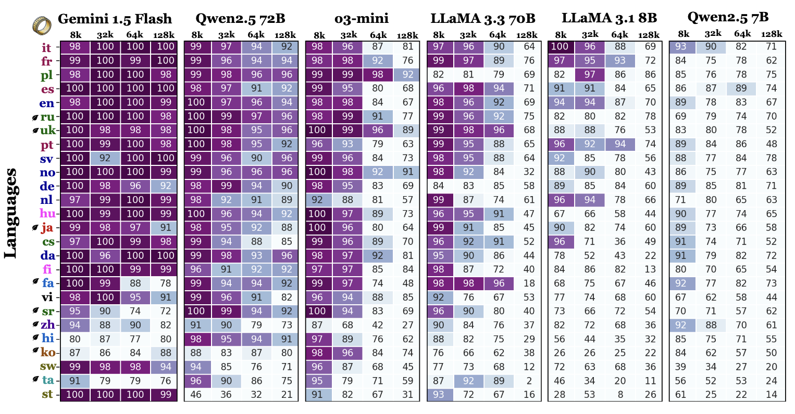

#  OneRuler
`Paper`: One ruler to measure them all: Benchmarking multilingual long-context language models 

`Authors`: Yekyung Kim, Jenna Russell, Marzena Karpinska, Mohit Iyyer

ONERULER is a multilingual benchmark designed to evaluate long-context language models across 26 languages. ONERULER adapts the English-only [RULER](https://arxiv.org/pdf/2404.06654) benchmark by including seven synthetic tasks that test both retrieval and aggregation, including new variations of the “needle-in-a-haystack” task that allow for the possibility of a nonexistent needle. We translate English instructions for each task and then collaborating with native speakers to translate them into 25 additional languages and experiment with both 5 open source and 2 closed model.

This code is based on [RULER's Repo](https://github.com/NVIDIA/RULER). 



## 🗃️ Data Generation

1. Install requirement.txt
```bash
pip install -r requirement.txt
```

2. Check `prompt`, `books` and `vocabs` directories are existed!
   * `prompt`, `books` and `vocabs` translated to 26 languages will be in OneRuler/data/
   * `prompt`: Contains 26 directories with language codes, each having prompts for two tasks (`niah.txt` and `cwe.txt`)
     * `niah.txt`: Dictionary format. We divide NIAH template into partial instructions to ensure all variables can be substituted in templates without grammatical changes (e.g., singular/plural forms, gender variants).
   ```json
    {
      "task": "Please read and memorize the text below. I will ask you about it later.\n\n<text>\n{context}\n</text>\n\n",
      "needle_words": "The special magic word for \"{key}\" is: {value} ",
      "needle_numbers": "The special magic number for \"{key}\" is: {value} ",
      "question_single_numbers": "<Question> What special magic numbers associated with \"{query1}\" are mentioned in the provided text?",
      "question_single_words": "<Question> What special magic words associated with \"{query1}\" are mentioned in the provided text?",
      "question_multi_numbers": "<Question> What special magic numbers associated with \"{query1}\" and \"{query2}\" are mentioned in the provided text?",
      "question_multi_words": "<Question> What special magic words associated with \"{query1}\" and \"{query2}\" are mentioned in the provided text? ",
      "please_list": "Please list all that apply.",
      "if_no_numbers": "If no such numbers exist, please answer \"none\".</Question>\n\n\n",
      "if_no_words": "If no such words exist, please answer \"none\".</Question>\n\n\n",
      "answer_prefix": "Please provide your answer in the following format:\n",
      "answer_words": "<Answer> List all words here </Answer>",
      "answer_numbers": "<Answer> List all numbers here </Answer>",
      "none": "none"
     }
     ```
     * `cwe.txt`: Full instruction template
   ```txt
    {
      Below is a numbered list of words. In these words, some appear more often than others. Memorize the ones that appear most often.
      <List> {context} </List>
      <Question> What are the 10 most common words in the above list? </Question> 
      Please provide your answer in the following format:
      <Answer> List the words here </Answer>
     }
   ```
   * `books`: Each language has a book. This is used as a distractor in the `niah` task.
   * `vocabs`: Contains 1) `100_noun_list_translated.tsv` and 2) `dictionaries` of words in 26 languages
     * `100_noun_list_translated.tsv`: 100 selected nouns translated into 26 languages with descriptions. Each column represents a different language. It used for `niah` task.
     * `dictionaries`: Word lists with part-of-speech tagging. We used these for Common Word Extraction (`CWE`) task, filtered by nouns, adjectives, and verbs.

3. Check your config_task.sh and config_model.sh (located in `config` directory)
   * `config_task.sh`: This is for setting task configuration including number of samples and tasks to run.
   * `config_model.sh`: This is for setting which model to run for data generation and their configuration.

4. Run `run_data_generation.sh` or `run_data_generation_xling.sh`
   * Set your path of `HF_HOME`, `STANZA_RESOURCES_DIR` and save directory. Otherwise, Huggingface and Stanze will save model to your home directory.
   ```markdown
    export HF_HOME=''
    export STANZA_RESOURCES_DIR=''

    GPUS="1" # GPU size for tensor_parallel.
    ROOT_DIR="dataset" # the path that stores generated task samples and model predictions.
    MODEL_DIR="../.." # the path that contains individual model folders from HUggingface.
    CONFIG_DIR='./config/'
    ENGINE_DIR="." # the path that contains individual engine folders from TensorRT-LLM.
    BATCH_SIZE=1  # increase to improve GPU utilization
   ```
   * Run with arguments
     * Mono-lingual: bash run_data_generation.sh {model_name} synthetic {language_code}
     ```markdown
     bash run_data_generation.sh Llama3 synthetic ko
      ```
     * Cross-lingual: bash run_data_generation_xling.sh {model_name} synthetic {context_language_code} {instruct_langauge_code}
     ```markdown
     bash run_data_generation_xling.sh Llama3 synthetic ko en
      ```
## 🔬 Evaluation

Run eval/evaluate.py with arguments:
* `input_path`: Path to the input file to evaluate
* `task`: Task being evaluated
* `language`: Language of the evaluation
* `model_name`: Name of the model being evaluated
* If you generate dataset with the above steps, your data will be saved to a path like `/BASE_DIR/MODEL/LANGUAGE/CONTEXT/TASK/validation.jsonl`. This means that your data path contains information about task, language, context length, and model name, so feel free to modify the evaluation code for your convenience!


## 🕵️‍♀️ Trouble Shooting 
*  If data generation takes too much time, it could be:
   1.  If you are running the NIAH task, running Stanza on CPU takes longer! We recommend using GPU for data generation for the NIAH task.
   2.  There are issues in the code (wrong path or errors), but `prepare.py` uses `subprocess`, so it sometimes gets stuck without giving an error. If you want to make sure, you can debug the task code directly via the printed command.
